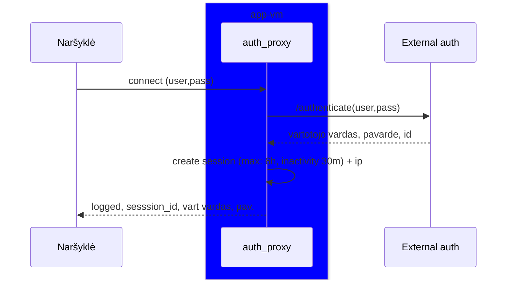
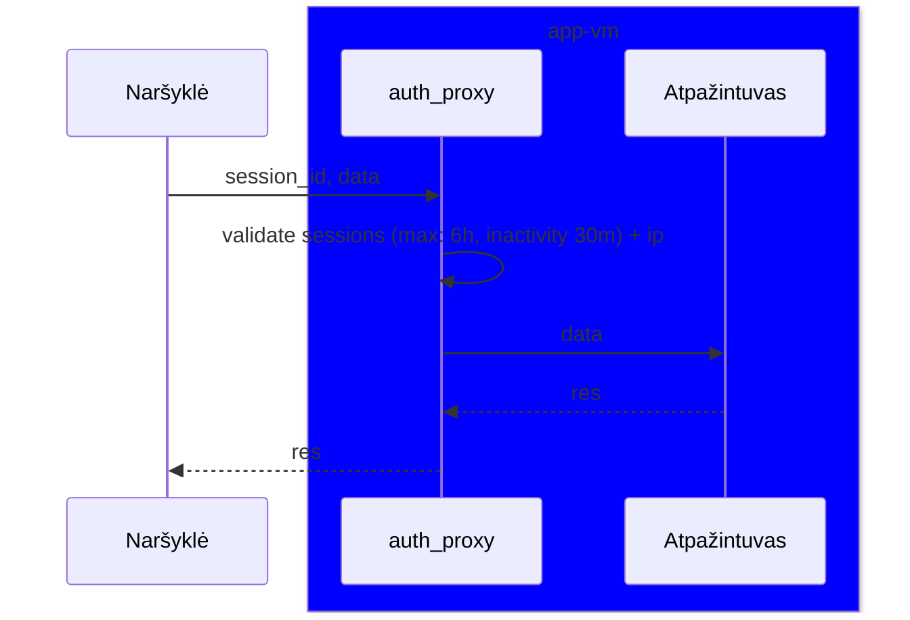
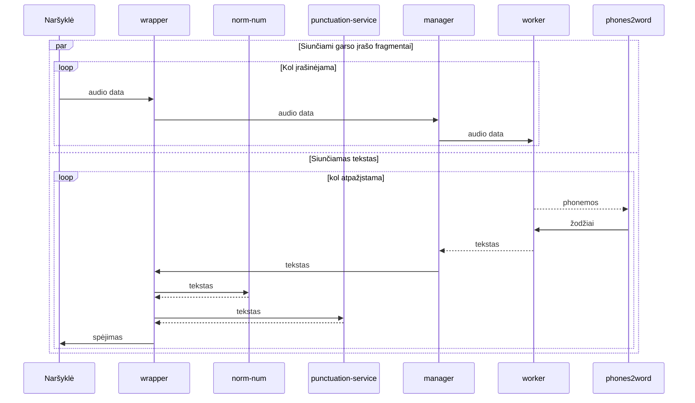
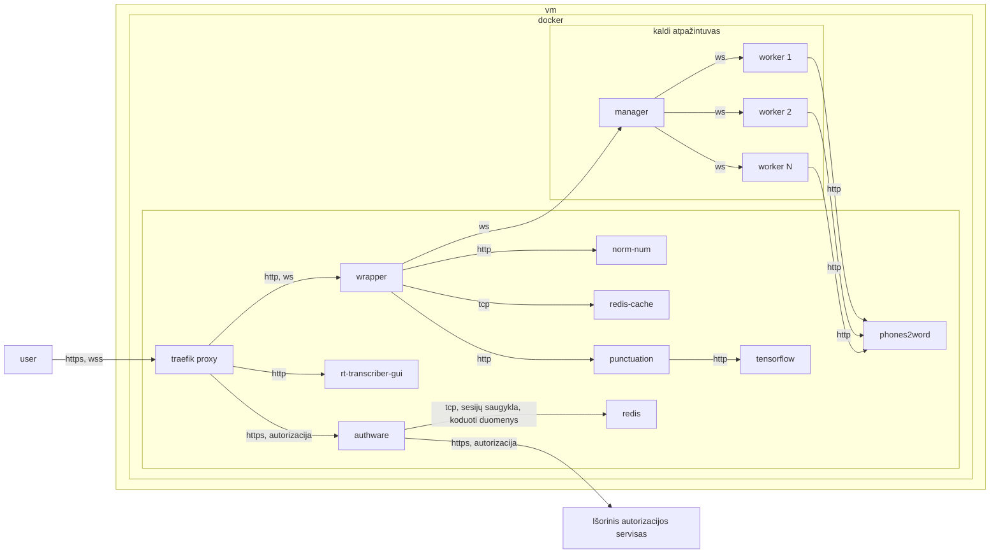

# Realaus laiko transkribatorius

## Aprašymas

Sistema:
- naršyklėje įrašo garsą iš mikrofono
- realiu laiku transkribuoja ir pateikia vartotojui atpažintą tekstą
- leidžia balso komandomis valdyti atpažinimo pradžią, pabaigą
 

### Realizacija

Sistema remiasi [Kaldi atpažinimo varikliu](https://github.com/alumae/kaldi-gstreamer-server). Sukurti papildomi komponentai, kurie skirti lietuvių kalbos skyrybos ženklų atstatymui, teksto koregavimui. Kad būtų paprasčiau diegti, visi komponentai realizuoti docker konteineriais.

### Komponentai

Sistemą sudaro šie komponentai:

| Pavadinimas         | Paskirtis                                                                                                                                     |
| ------------------- | --------------------------------------------------------------------------------------------------------------------------------------------- |
| proxy (Traefik)     | Proxy servisas, paskirsto užklausas tarp sistemos servisų, leidžia pasiekti servisus iš išorės, gali būti naudojamas autorizavimui užtikrinti |
| manager             | Kaldi pagrindinis serveris, koordinuoja transkribavimo darbus                                                                                 |
| worker              | Kaldi atpažinimo serveris, atlieka realų transkribavimą. Gali būti paleidžiami keli atpažinimo serveriai                                      |
| wrapper             | Papildomas tarpinis servisas, kuriame papildomai apdorojamas grąžintas tekstas                                                                |
| redis               | Redis talpykla, naudojama laikinam audio duomenų ir atpažinto teksto saugojimui. Saugomi šifruoti duomenys                                    |
| authware            | Vartotojų autentifikavimo ir autorizavimo servisas                                                                                            |
| tensorflow          | Tensorflow Serving, skirtas skyrybos ženklų modeliui aptarnauti                                                                               |
| punctuation-service | Servisas, atkuriantis skyrybos ženklus transkribuotame tekste                                                                                 |
| norm-num            | Skaičių normalizavimo servisas                                                                                                                |
| phones2word         | Fonemų į žodžius konvertavimo servisas                                                                                                        |
| rt-transcriber-gui  | Naršyklės vartotojo sąsaja (frontend)                                                                                                         |

## Procesų diagramos

### Autorizacijos pavyzdys

### Kreipinys į atpažintuvą

### Detali atpažinimo proceso schema (be autentifikavimo)

## Komponentų diegimo pavyzdys

