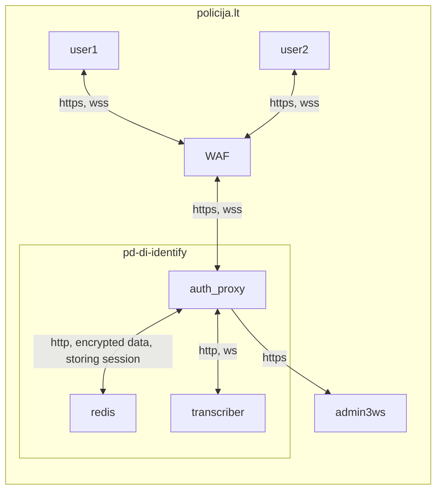

## Deploy

```mermaid
graph LR
    subgraph policija.lt
        user1[user1]
        user2[user2]
        waf[WAF]
        auth[admin3ws]
        subgraph pd-di-identify
            auth_proxy[auth_proxy]
            redis[redis]
            rtasr[transcriber]
        end
    end
    user1 <--> |https, wss| waf
    user2 <--> |https, wss| waf
    waf <--> |https, wss| auth_proxy
    auth_proxy --> |https| auth
    auth_proxy <--> |http, encrypted data, storing session| redis
    auth_proxy <--> |http, ws| rtasr
```    