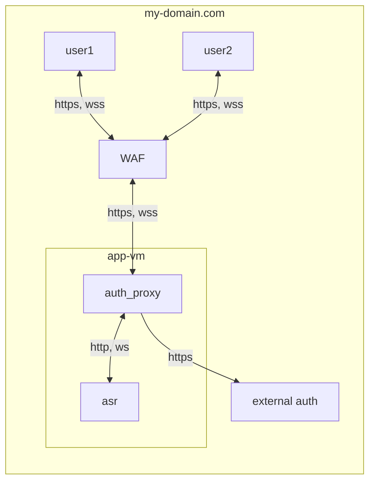
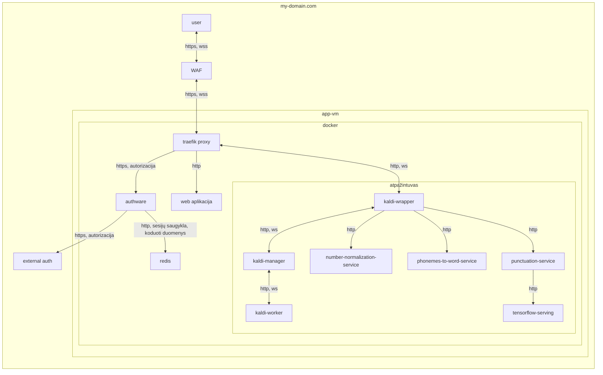

## Diegimo schema

#### Supaprastinta

```mermaid
graph LR
    subgraph my-domain.com 
        user1[user1]
        user2[user2]
        waf[WAF]
        auth[external auth]
        subgraph app-vm
            auth_proxy[auth_proxy]
%%            redis[redis]
            rtasr[asr]
        end
    end
    user1 <--> |https, wss| waf
    user2 <--> |https, wss| waf
    waf <--> |https, wss| auth_proxy
    auth_proxy --> |https| auth
%%    auth_proxy <--> |http, encrypted data, storing session| redis
    auth_proxy <--> |http, ws| rtasr
```    

#### Detali diegimo schema

```mermaid
graph LR
    subgraph my-domain.com 
        user[user]
        waf[WAF]
        auth[external auth]
        subgraph app-vm
            redis[redis]
            subgraph docker
             traefik[traefik proxy]
             authware
             redis
             subgraph atpažintuvas
               kaldi-wrapper
               punctuation-service
               tensorflow-serving
               kaldi-manager
               kaldi-worker
               number-normalization-service
               phonemes-to-word-service
             end
             web[web aplikacija]
            end
        end
    end
    user <--> |https, wss| waf
    waf <--> |https, wss| traefik
    traefik --> |https, autorizacija| authware
    traefik --> |http| web
    authware --> |https, autorizacija| auth
    authware --> |http, sesijų saugykla, koduoti duomenys| redis
    traefik <--> |http, ws| kaldi-wrapper
    kaldi-wrapper <--> |http, ws| kaldi-manager
    kaldi-manager <--> |http, ws| kaldi-worker
    kaldi-wrapper --> |http| number-normalization-service
    kaldi-wrapper --> |http| phonemes-to-word-service
    kaldi-wrapper --> |http| punctuation-service
    punctuation-service --> |http| tensorflow-serving
```    