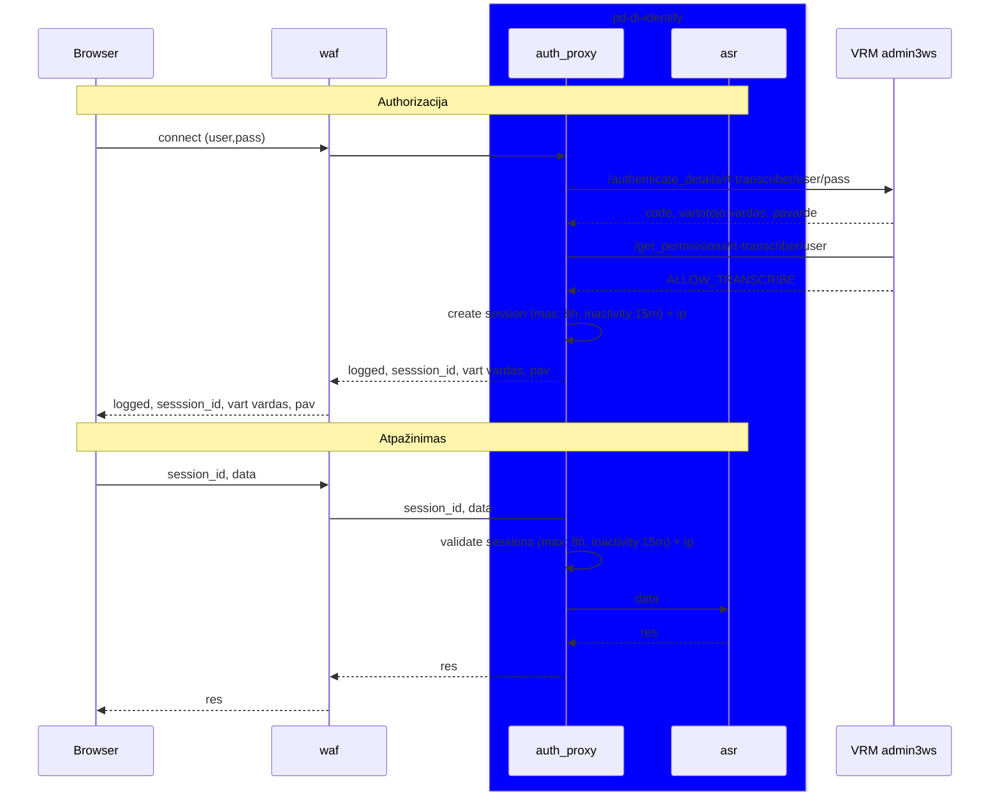

## Design

```mermaid
sequenceDiagram
    participant user as Browser
    participant waf
    box blue pd-di-identify
    participant auth_proxy
%%    participant redis
    participant asr
    end
    participant auth as VRM admin3ws
    
    Note over user,asr: Authorizacija

    user->>waf: connect (user,pass)
    waf->>auth_proxy: 
    auth_proxy->> auth: /authenticate_details/rt-transcriber/user/pass
    auth -->> auth_proxy: code, vartotojo vardas, pavarde
    auth_proxy-> auth: /get_permissions/rt-transcriber/user
    auth -->> auth_proxy: ALLOW_TRANSCRIBE
    auth_proxy->> auth_proxy: create session (max: 8h, inactivity 15m) + ip
%%    auth_proxy->> redis: store encrypted data (key: ip + session_id)
%%    redis --> auth_proxy: 
    auth_proxy -->> waf: logged, sesssion_id, vart vardas, pav
    waf -->> user: logged, sesssion_id, vart vardas, pav


    Note over user,asr: Atpažinimas
    user->>waf: session_id, data
    waf->auth_proxy: session_id, data
%%    auth_proxy->> redis: auth_proxy->> redis: get session (key: ip + session_id)
%%    redis --> auth_proxy: 
    auth_proxy->> auth_proxy: validate sessions (max: 8h, inactivity 15m) + ip
%%    auth_proxy->> redis: mark last used time
%%    redis -->> auth_proxy: 
    auth_proxy->> asr: data
    asr -->> auth_proxy: res
    auth_proxy -->> waf: res
    waf -->> user: res
```    

